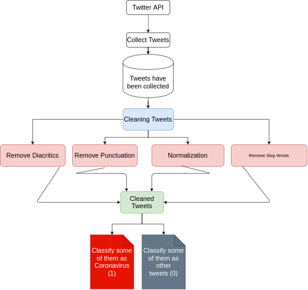
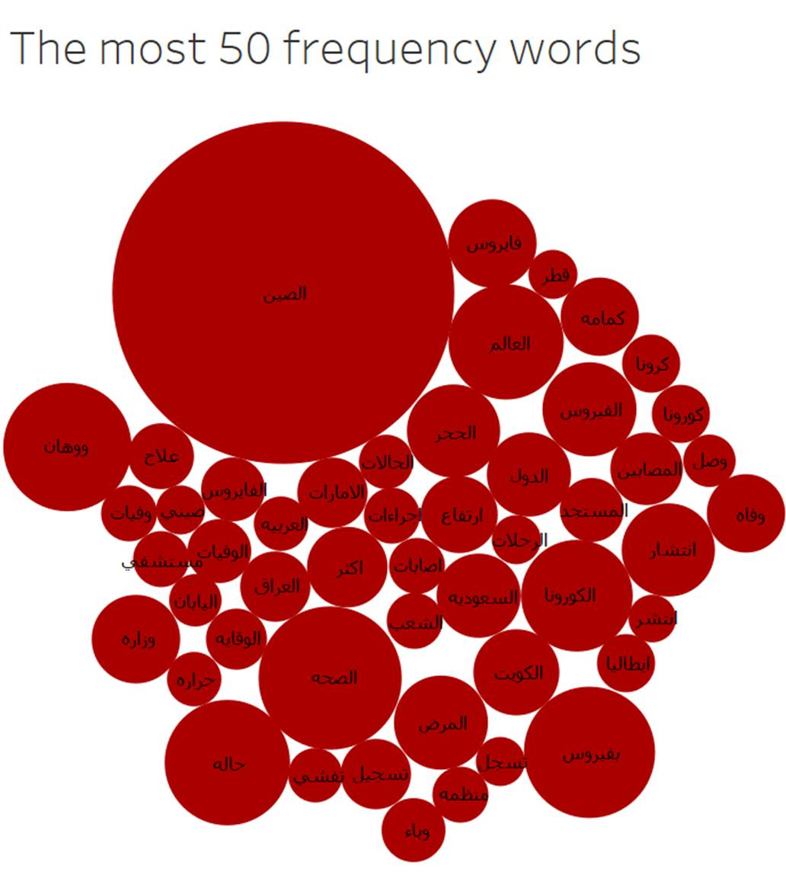
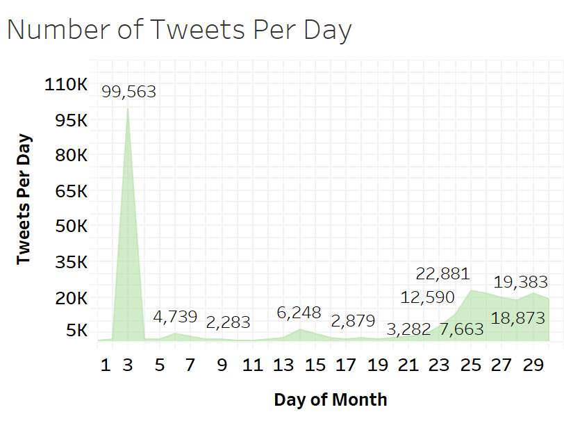
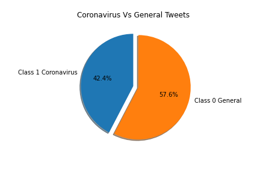

# Large-Arabic-Twitter-Dataset-gathering-cleaning-analysis-on-COVID-19

## Arabic-Hands-on-Analysis-Clustering-and-Classification-of-Large-Arabic-Twitter-Data-set-on-COVID19

### INTRODUCTION

There has been a lot of work on COVID19 social media data but little done on Arabic Data sets on extract information,analysis and classification of these data sets. In this current work we choose to work with Arabic data which contain amazing features and challenging nature. Arabic language is the fifth most spoken language in the entire world. Arabic language is the fourth language on internet. Arabic language is very challenging language to work with because it contains diacritics that can change the meaning of the sentence. Arabic language has a difficult grammar structure than non Arabic languages. There are other challenges when dealing with Arabic language for example sentences written different grammatically has different meaning despite using similar words.

In this work we have passed through different stages from collection tweets to processing of the tweets, analysis these tweets, and lastly to classify these tweets on Coronavirus and general tweets to demonstrate that weets  collected based  on  some  keywords  like  [كورونا, الصين, تفشى, السفر] ,  and  other words, based on the different analysis and models,we  have  seen  that  more  than  55%  of  these  tweets  are  talking about  other  topics,  not  on  the  Coronavirus.

#### The full Pipeline.

### COLLECTING DATA

We have used the research paper of Large Arabic Twitter Dataset on COVID-19 by Sarah Alqurashi, Ahmad Alhindi, Eisa Alanazi, which lead us to the repo
[COVID-19-Arabic-Tweets-Dataset](https://github.com/SarahAlqurashi/COVID-19-Arabic-Tweets-Dataset) that have the tweets ids.

After that we used the twitter developer account that we have to collect these tweets text from the tweet Id they provide and we have collected more than 3,000,000 tweets overall from about 4,000,000.

### DATA ANALYSIS
Spending some times to analysis the tweets content like themost repeated words and the similar words, this time spendingwith the analysing of the data help us in the pre-processing phase and besides it help us to to choose the models that canfit within the training, and get a good result in the testing phase using the weights of the models we have trained.

  
  

### DATA  PROCESSING

From collecting data to the stage of pre-processing thesedata, then label more than 15,000 tweets to class 0 for general tweets and 1 for Coronavirus tweets then use machine learningmodels to classify the whole large data set.The data comes in different ways, and the way we getthe data in have some of the other information that we arenot interested in, in our case of tweets text, it may containa lot of different URLs, which can cause error while themodel learning, others like diacritics which related to ourmain problem in Arabic language, and the tweet we get fromTwitter API is raw tweet.
So we have:

- Remove Diacritics
- Remove punctuation and URLs
- Normalize the Text

And we can see the code and report associated with this part of work from here:

[Cleaning Data](https://github.com/Abdelrahmanrezk/Arabic-Hands-on-Analysis-Clustering-and-Classification-of-Large-Arabic-Twitter-Data-set-on-COVID19/blob/main/config_files/cleaning.py)

[Cleaning Report](https://github.com/Abdelrahmanrezk/Arabic-Hands-on-Analysis-Clustering-and-Classification-of-Large-Arabic-Twitter-Data-set-on-COVID19/blob/main/reports/pdf%20reports/Report_1_2_3_Configs_Gather_Clean_Data.pdf)

### MACHINE LEARNING

We have used three machine learning models to classify the data setwhich are random forest, SVC and logistic regression. Weannotate 15000 tweets using two classes annotation 0 and1. We compare our results between the three models afterfine-tuning the parameters in different floods first using theCross-validation for 5 floods then we have tested our last chosen Logistic Regression model as it gives the best trade-off between the most common problems in machine learning overfitting and underfitting to get more than 91% while it wasmore than 93% on different floods which were different in 2%out of overfitting and underfitting because of high predictionscore, and our results show that the classification AI modelsprove our idea that there is more than 55% of the tweets arenot related to COVID19.

### CONCLUSION AND  FUTURE WORK

In this work we introduce our cleaning, analysis,Classification and clustering on a large Arabic data set. wenoticed that large percentage of the data set is not related to COVID 19. To prove your conclusion using machine learning models we made pre-processing to the data set. We did someanalysis to the tweets like frequency count where we countthe frequency of repetition of each word in the tweets. Usingthis analysis we were able to get some insights from the dataset. We have manually annotated 15000 tweets randomly fromthe data set and annotated them highly related to COVID1 tweets and non-related to COVID19 tweets to test our hypo-sisthat  many  tweets  are  not  related  to  COVID19  we  used  threemachine  learning  models  random  forest,  SVC  and  logisticregression.  We  got  working  models  with  good  results  thisshows  more  than  55%  of  the  data  set  is  not  related  toCOVID19  but  only  uses  similar  worlds  that  is  related  toCOVID19.  We  also  applied  a  clustering  technique  to  verifyour  hypo-sis  using  k-means  classification  we  reached  70%accuracy  which  is  affected  by  similar  words  but  prove  ourhypo-sis  that  their  is  a  large  portion  of  the  data  set  is  nothighly related to COVID19 and additional pre-processing stepis  required  to  work  with  such  data  sets  that  relay  on  relatedwords to collect data set. Future work will include sentimentanalysis for the highly related tweets.
